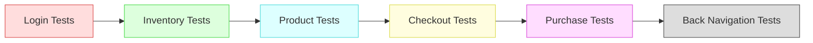

# Documentação de Testes E2E com Playwright

Este documento descreve de forma **robusta** como os testes E2E (End-to-End) estão organizados e funcionando, utilizando **Playwright**. Abaixo, há um **fluxo geral** (representado em um diagrama Mermaid) que ilustra a sequência típica de cenários testados, bem como detalhes sobre a estrutura de testes e a abordagem **Application Actions**.

---

## Visão Geral dos Testes



1. **Login Tests**: Verificam o fluxo de login com credenciais válidas e inválidas, garantindo que o usuário consiga acessar a aplicação corretamente.  
2. **Inventory Tests**: Testam a tela de inventário (lista de produtos), incluindo adição de múltiplos itens ao carrinho e ordenação de produtos.  
3. **Product Tests**: Focam em ações de produto (ex.: detalhes de um item específico, remoção de itens aleatórios do carrinho, verificação de itens no carrinho).  
4. **Checkout Tests**: Cuidam do fluxo de checkout, conferindo possíveis erros ao preencher dados, bem como a etapa “Step Two”, validando valores (subtotal, taxa e total).  
5. **Purchase Tests**: Englobam a finalização da compra (clicando em “Finish”) e conferindo se a compra foi concluída com sucesso.  
6. **Back Navigation Tests**: Verificam botões de cancelamento ou retorno em etapas de checkout, garantindo que a navegação volte para a tela correta (por exemplo, voltar do Step Two para o Step One ou do Step One para o carrinho).

---

## Estrutura de Pastas

A organização das pastas de testes é algo como:

```
tests/
├─ backNavigation/
│   └─ back-navigation.spec.js
├─ checkout/
│   ├─ checkout-error.spec.js
│   └─ checkout-step-two.spec.js
├─ inventory/
│   ├─ inventory-add-multiple.spec.js
│   ├─ inventory-add-products.spec.js
│   └─ inventory-sort.spec.js
├─ login/
│   └─ login.spec.js
├─ product/
│   ├─ cart-items-verification.spec.js
│   ├─ product-details.spec.js
│   └─ remove-random-items.spec.js
└─ purchase/
    ├─ purchase-finalization.spec.js
    └─ purchase.spec.js
```

- **backNavigation/**: Testes de navegação de retorno/cancelamento no checkout.  
- **checkout/**: Testes relacionados ao fluxo de checkout (erros e Step Two).  
- **inventory/**: Testes de inventário (adição de itens, ordenação etc.).  
- **login/**: Testes de login (credenciais válidas, inválidas).  
- **product/**: Testes de manipulação de produtos e carrinho (detalhes, remoção aleatória, verificação).  
- **purchase/**: Testes de finalização da compra (purchase-finalization) e fluxo geral (purchase.spec.js).

---

## Abordagem “Application Actions”

Cada teste está **mais limpo** e focado em asserções graças ao padrão **Application Actions**, em que a lógica de interação com a UI (clicar, preencher, navegar) fica em funções isoladas nos arquivos `actions/`. Por exemplo:

- **loginAction.js**: Lógica de login e verificação de sucesso.  
- **inventoryAction.js**: Adicionar itens ao carrinho, obter nomes/preços.  
- **checkoutAction.js**: Preencher formulário de checkout, avançar etapas.  
- **removeItemAction.js**: Remover itens do carrinho, verificação de contagem.  
- **finishPurchaseAction.js**: Concluir compra (clicar em “Finish”) e checar se foi finalizada.

Assim, se a aplicação mudar um seletor ou o fluxo de checkout, basta ajustar a **action** correspondente, em vez de alterar vários arquivos de teste.

---

## Fluxo Típico de Teste

1. **Login**: 
   - Usa `loginAction.js` para preencher usuário e senha e confirmar sucesso.
2. **Inventário**:
   - Adiciona um ou vários produtos ao carrinho (`inventoryAction.js`).
   - Verifica ordenação ou contagem de produtos.
3. **Produto** (opcional):
   - Se quiser testar detalhes do produto, clica em um item e checa nome/preço (`productDetailsAction.js`).
4. **Checkout**:
   - Vai para o carrinho, clica em “Checkout” e preenche dados (`checkoutAction.js`).
   - Valida possíveis erros (ex.: `checkout-error.spec.js`) ou verifica preços (`checkout-step-two.spec.js`).
5. **Purchase**:
   - Conclui a compra clicando em “Finish” (`finishPurchaseAction.js`).
   - Garante que a tela de “Thank You” (checkout-complete.html) aparece.
6. **Back Navigation** (opcional):
   - Em algum momento, pode-se cancelar ou voltar para a tela anterior (`backNavigationAction.js`).

---

## Conclusão

Este conjunto de testes **end-to-end** cobre todo o fluxo do usuário, desde o **login** até a **finalização** da compra, validando também comportamentos intermediários como **detalhes de produto**, **remoção de itens** e **navegação de retorno**. A arquitetura em **Application Actions** mantém o projeto escalável e fácil de manter, e a divisão em subpastas torna cada cenário bem organizado.